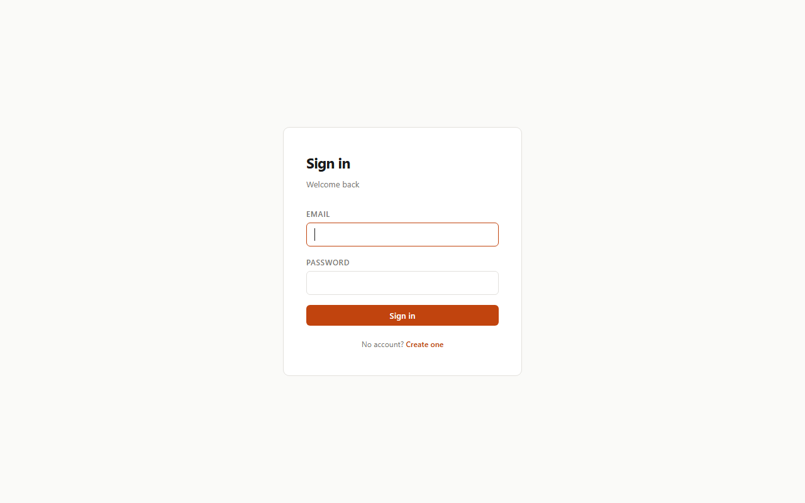
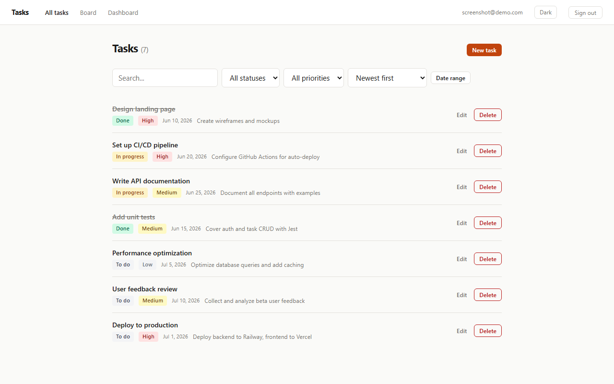
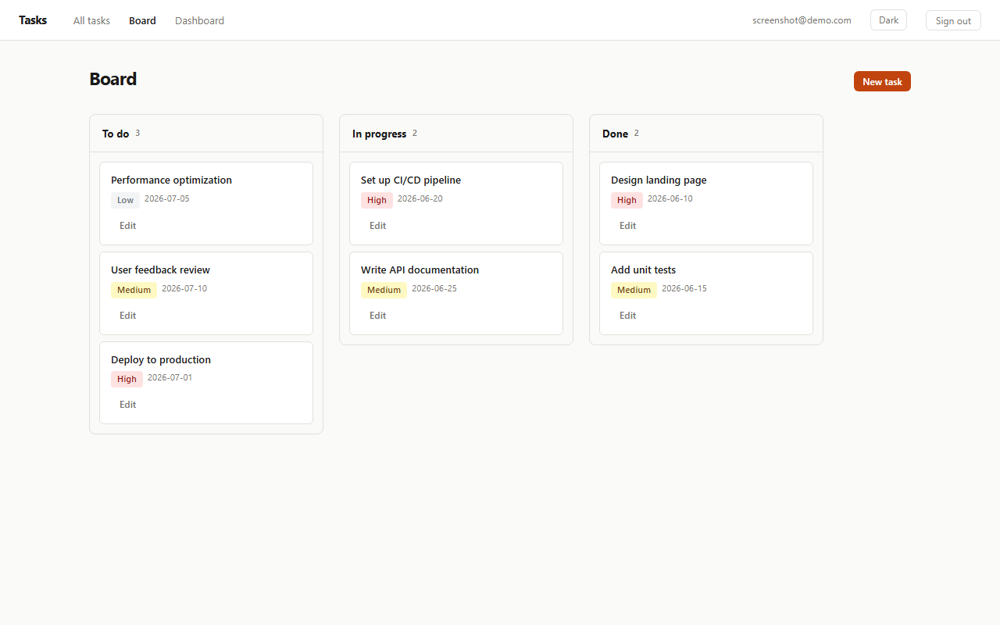
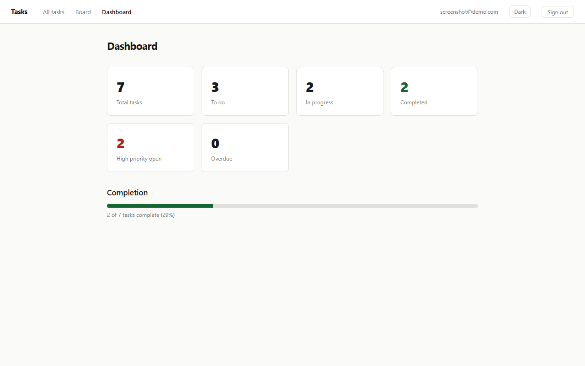
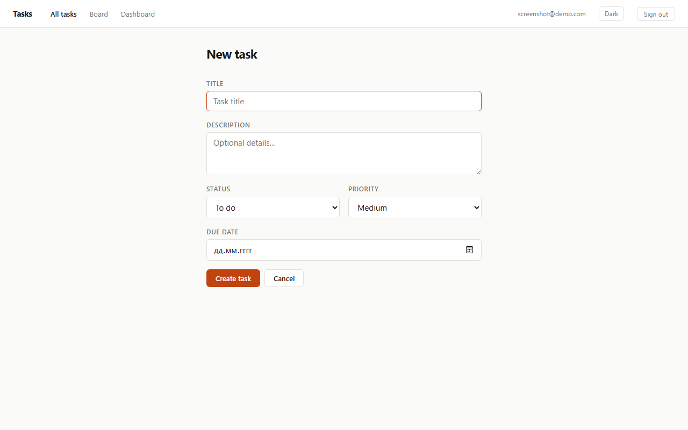
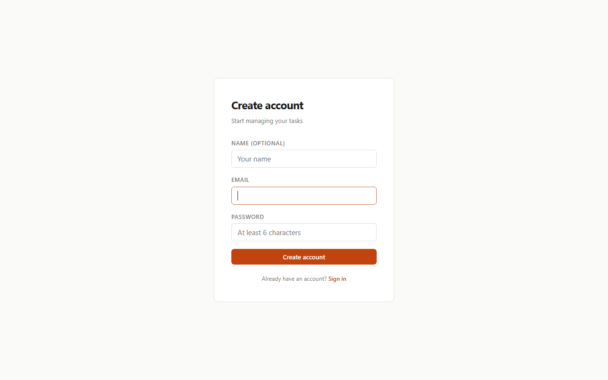

# Task Manager

A full-stack task management application built with Node.js, Express, React, and SQLite.

## Stack

| Layer    | Technology |
|----------|-----------|
| Backend  | Node.js 24, Express 4 |
| Database | SQLite via `node:sqlite` (built-in, no compilation) |
| Auth     | JWT (jsonwebtoken) + bcryptjs |
| Frontend | React 19, Vite 6, plain CSS |
| Routing  | react-router-dom v7 |
| Tests    | Jest + Supertest |

## Setup

### Requirements

- Node.js 22+ (uses the built-in `node:sqlite` module)

### Backend

```bash
cd backend
cp .env.example .env        # edit JWT_SECRET before deploying
npm install
npm start                   # runs on http://localhost:3001
```

### Frontend

```bash
cd frontend
npm install
npm run dev                 # runs on http://localhost:5173
```

### Tests

```bash
cd backend
npm test
```

All tests run in-memory (no file system side effects).

## Features

- **Auth** — register / login by email + password; JWT-protected API; passwords hashed with bcrypt
- **Task CRUD** — create, list, edit, delete tasks; each user sees only their own
- **Fields** — title, description, status (`todo` / `in_progress` / `done`), priority (`low` / `medium` / `high`), due date
- **Search** — full-text search across title and description
- **Filters** — filter by status, priority
- **Sort** — sort by created date, due date, or priority
- **Board view** — drag-and-drop kanban columns (todo → in progress → done)
- **Dashboard** — task statistics: totals, completion %, overdue count, high-priority open

## API

```
POST   /api/auth/register   body: { email, password, name? }
POST   /api/auth/login      body: { email, password }
GET    /api/auth/me         Authorization: Bearer <token>

GET    /api/tasks           ?search= &status= &priority= &sort= &due_from= &due_to=
POST   /api/tasks           body: { title, description?, status?, priority?, due_date? }
GET    /api/tasks/:id
PUT    /api/tasks/:id       body: partial task fields
DELETE /api/tasks/:id
```

## Project Structure

```
task-manager/
├── backend/
│   ├── src/
│   │   ├── db/database.js       SQLite setup and schema
│   │   ├── middleware/auth.js   JWT verification middleware
│   │   ├── routes/auth.js       register / login / me
│   │   ├── routes/tasks.js      task CRUD with filtering
│   │   └── server.js            Express app entry point
│   ├── tests/
│   │   ├── auth.test.js
│   │   └── tasks.test.js
│   └── package.json
├── frontend/
│   ├── src/
│   │   ├── api/client.js        fetch wrapper with JWT
│   │   ├── components/          Layout, TaskForm
│   │   ├── pages/               Login, Register, TaskList, TaskNew, TaskEdit, Board, Dashboard
│   │   ├── App.jsx              router + auth state
│   │   ├── main.jsx
│   │   └── index.css            design system (variables, components)
│   └── package.json
├── docs/
│   └── CONTRIBUTIONS.md
└── README.md
```

## Screenshots

| Login | Task List |
|-------|-----------|
|  |  |

| Board (Kanban) | Dashboard |
|----------------|-----------|
|  |  |

| New Task | Register |
|----------|----------|
|  |  |

## Design

- Color palette: warm off-white background (`#FAFAF8`), burnt-orange accent (`#C1440E`), near-black text
- Typography: system font stack, no web fonts loaded
- No emoji in UI elements, no gradient backgrounds, minimal decoration
